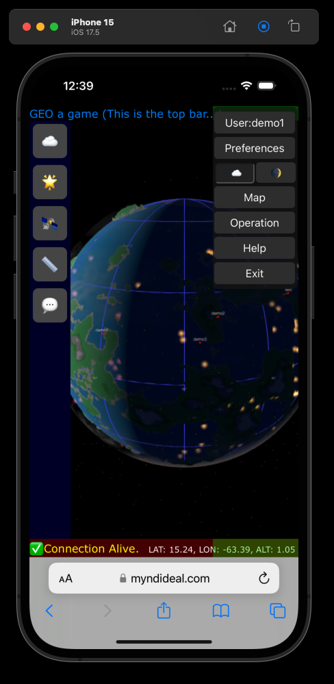
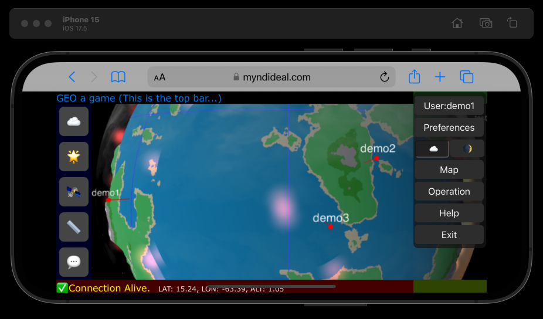

# geo1game
This will be a space-civilization type of game.
### Screenshots

  
    

  
  
  

## Documentation

For a technical overview of the map generation system, including structure and module responsibilities, see the [Map Generator Overview](doc/overview.md).

The [Development Plan](doc/devplan.md) describes the actual focus, and some [High level arichitectural](doc/architect.md) document is alredy written.

You can take a look at my [Online Demo](https://myndideal.com/geo/) to see the latest version in action.

### Quick history
See more [detailed history in changelog](doc/changelog.md).
##### Version 1.2
Massive redeign, adding more plugin APIs, and functionalities, build system, demonstration page and users.
##### Version 1.1
Server side implementation rewritten to native c for XenU VPS environment, where SIMD instruction are available. 
All of these works was done less in a weeek.
##### Version 1.0
At the time of 2025 Q1, I created a huge map generator just for fun. It was done just in one day (or less).

### Actually implemented:
- Linux server-side map and city generators, using not only SQLite or MySql database, but also a data specific huge binary 2.5D map subsystem with **native mathematical code** support. It works as a unix daemon behind an Apache proxy, and supports multiple protocols.
- The daemon can respond a request, generate the content, save it to a cache file, which is used in a time window.
- JSON reporter PHP scripts, which query the database using the lat/lon regions. (actually daemon can also do that in multiple ways now)
- Daemon can load and undload plugins dinamically, when needed. A plugin may cover diferent protocols, or internal architectural subsystems, like database drivers, or content generators. In example, we could implement some hunge and repetitiv math processor, which executes queries in the background, or calculates and update the database depending on a natively executed (fast) code. First I made pyhon codes, it was slow, then I created an .so with python api, it was better, then I completely move everything to a daemon, which one win the race: 2 minutes vs 10 secounds for the same sized map generation.
- There is yet very simply 3d model representation and generator (based on rules, it could synthetize a shape, or multiple basic objects). It is under development, and the goal is, to have some randomization regarding NPC models.
- Client side 3D visualization using the Three.js engine and shaders:
  - Elevation bumpmap
  - Biome-related colors
  - Day/night cycle
  - City lights visible at night
  - Edge of the atmosphere depending on star position
- 2D map (very preliminary) One of the main challenge is the distance 

I will probably rewrite all of the code later completely. :)

---