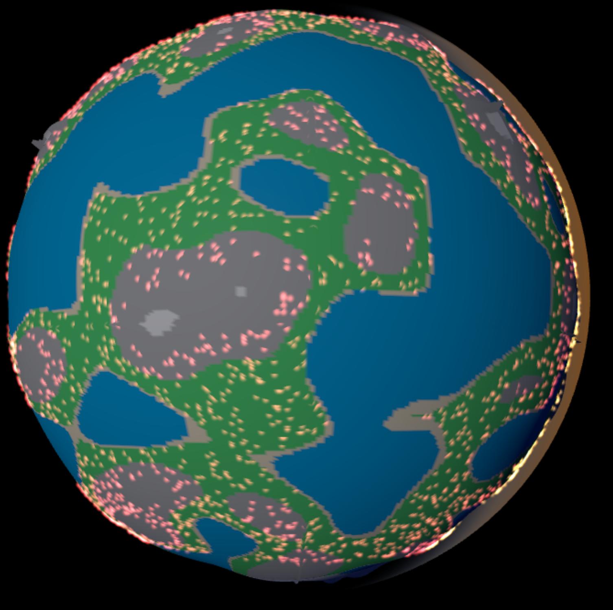
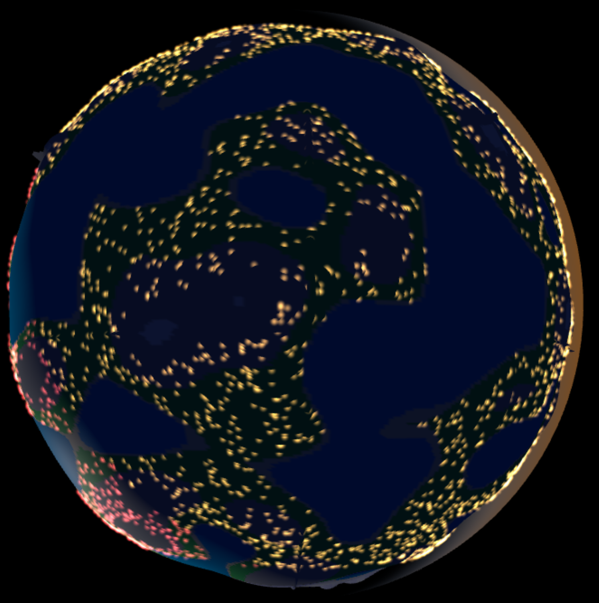
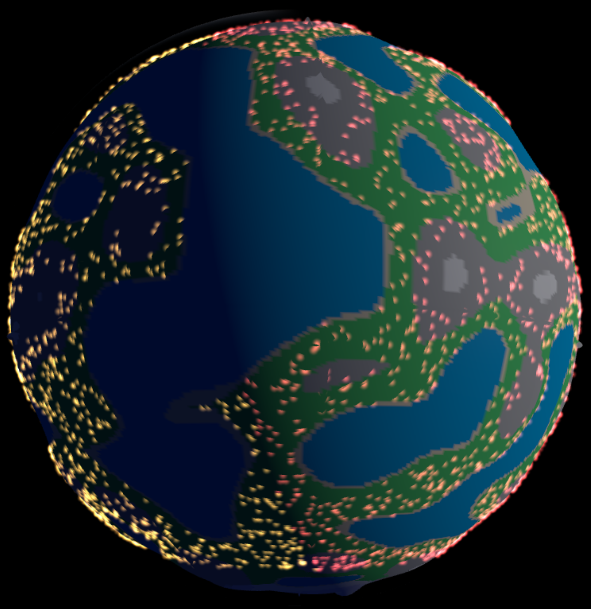

# geo1game
This will be a space-civilization type of game.

At the time of 2025 Q1, this is the very first version of the project. It was done just in one day (or less).

## Actually implemented:
- Linux server-side map and city generators, using SQLite database.
- JSON reporter PHP scripts, which query the database using the lat/lon regions.
- 3D visualization using the Three.js engine and shaders:
  - Elevation bumpmap
  - Biome-related colors
  - Day/night cycle
  - City lights visible at night
  - Edge of the atmosphere depending on star position
- 2D map (very preliminary)

I will probably rewrite all of the code later completely. :)

---

### Screenshots

