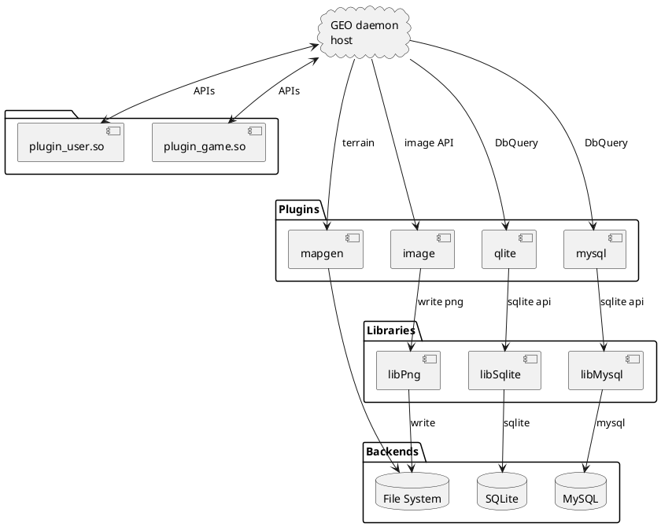
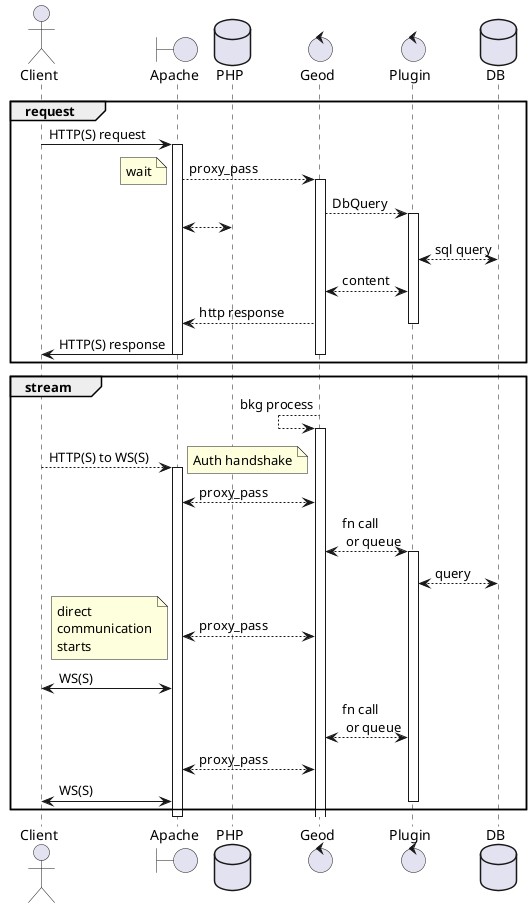
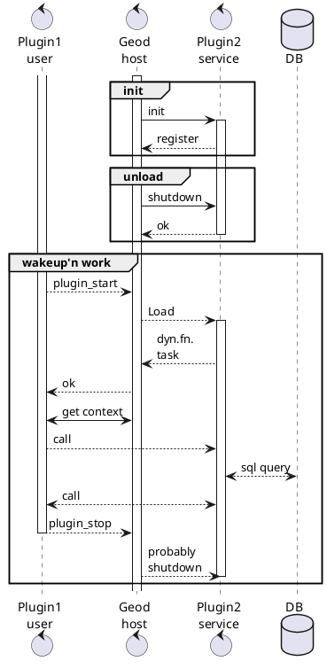

# Architectural overview

## System Architecture
Web client-server and mobile Application is the product.
- How the **system architect** looks like (in a nutshell)
  - at web browser client side
    - some www/j/*.js javascript modules are exeuted
    - there is a CommunicationController class, which provides the ws protocol or http requests are also available for fallback option
  - at webserver side
    - mostly php scripts, and apache proxy is used.
    - there is a configured apache virtualhost, with proxy settings for http, https and WebSocket ws:, wss: protocolls.
    - all of those internal requests serviced by a geod daemon
  - native clients
    - macos, ios, ipados, watchos is deffinetly planned (I already have a separated folder structure, which I would like to migrate here soon)
    - not-yet planned, but need an android variant (I know kotlin, but...)
    - probably windows target also a goal (game servers and users likes it)

## Component diagram
not so detailed, but help to clarify, some of the plugins need access to a 3rd party .so related static linkage, others are not requires any additional code space.

## Flow diagram
This diagram focus on the communication when HTTP or WS protocol is used.

- **Internal architecture**
    - the daemon memory footprint highly reduced 2.5 - 3 Mbytes. Mostly everithing is in .so files.
    - there is a plugin api with host interface and plugin interface
      - there is a registration phase, when the daemon starts, all of the plugins provides some permanent config (mostly textual keys)
      - plugins can be off-line state, when not even the codes are in the memory
      - in case of a plugin provided function is needed, the daemon loads the so.
    - both the daemon and the plugins are threaded, reentrant or mutex locked.
    - there are generalized and specialized APIs. All of the plugins could always call the host interface, or request a plugin to start and call the specific API.
    - there is a home-keeper thread, which is checking the last api acces of a plugin, and unloads it if not needed.
    - there is an
      - general load-unload (init, finish ) thread access (init, finish) API
      - event API to trigger a plugin
      - cache (file handling) API
      - image file generation (png) API
      - HTTP, WebSocket API
      - Map generator and query API

## Flow diagram
This diagram focus on the load and unload sequence.

## Open points or questions
- The DbQuery and response will be improved soon. Yeah, but how is the best ?
- I am wondering, if low level sql is the best, or shall we implement an abstraction layer, a DDL, DML soulution?
- Would be a good idea to get compatible with others?
- 
