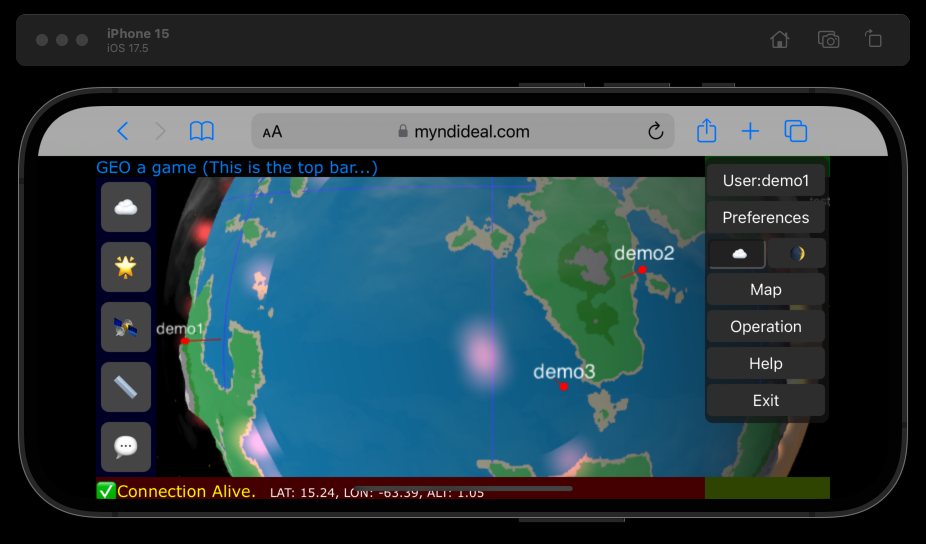

# CHANGE LOG
History...
The version numbering of the development phase is very simple. I will increment the sub version number, if a greater achivement or plan were realized. But this version numbers are not the release numbers! There is no any released version of the repo yet. The development versions are not always incremented, due to I am working on it, and push some small changes periodically. In this case I am refering to a change as version nr and update nr. 

## Version 1.2

  
    

#### update 5
new focus: Websocket, JSON, (abstract) database api added.
Build system refactoring is planned (how to, what to do) documented. Some more documentation added (like this).
**Note**: from this version, the repository files licensing has been changed from MIT to modified MIT. The difference is only related to the commercial use of any part of the repo, but not related to personal use -in any way-, the free software is free software. Also, my company is open to deal with any commercial, business or development questions from this point...

#### update 1-4
Server-side: the plugin architecture has been rewritten to use native C language with dynamically registered modules.  
If a subsystem is not in use, a housekeeping mechanism automatically unloads its plugin to free memory.  
When the subsystem is needed again, the corresponding `.so` file is reloaded and memory is reallocated.  
The map generation system has also been rewritten using a similar unloadable module structure and will be unified under the new plugin system soon.  
One example plugin is a JSON generator (the HTTP protocol implementation is also now handled via plugins).  
A template-based 3D model generator has been implemented, capable of synthesizing 3D models from templates and parameter sets.  
Templates support constraints, allowing controlled randomization.  
Plugins can be replaced or rebuilt during runtime.  
The daemon handles the `SIGUSR1` signal to trigger plugin reloading, and will automatically restart plugins if they are not currently loaded.  
Both init.d and systemd-compatible service configurations are provided.

## Version 1.1
Server side implementation rewritten to native c for XenU VPS environment, where SIMD instruction are available. To prepare these steps, the scalar calculations are reorganized to be multiple operands for each phase.
A preliminary compute kernel is implemented, where N oerands are prepared to compute. Even that points which are not yet massively paralelized, shaped in this form to be ready to implement that way.
All of these works was done less in a weeek.

## Version 1.0
At the time of 2025 Q1, this is the very first version of the project. It was done just in one day (or less).

## Eerly features (v1 - v1.1)
- It was a proof-of-concept level implementation.
- Linux server-side map and city generators, using SQLite database.
- JSON reporter PHP scripts, which query the database using the lat/lon regions.
- 3D visualization using the Three.js engine and shaders:
  - Elevation bumpmap
  - Biome-related colors
  - Day/night cycle
  - City lights visible at night
  - Edge of the atmosphere depending on star position
- 2D map (very preliminary)

  
  
  

In time of v1.2 the visual content was not drammatically improved comparing to these early versions, due to the server side architecture were in focus, and a complete refactoring was done.